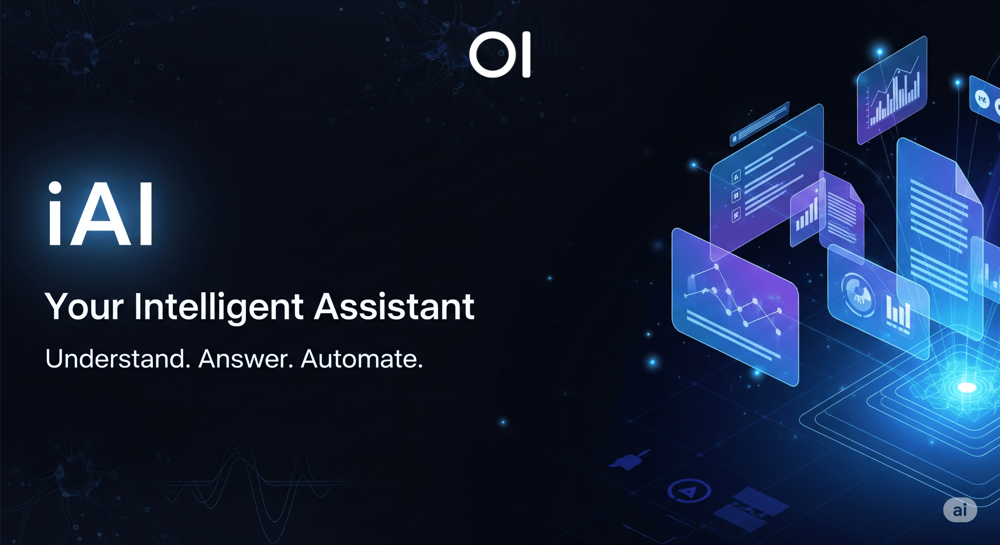



# 🤖 AI Assistant – Document Question Answering

An AI-powered assistant capable of answering questions from a **document base** using **semantic search**, **embeddings**, and a **retrieval-augmented generation (RAG)** pipeline.

This project processes unstructured documents (e.g. PDFs, text files), splits their content into chunks, generates vector embeddings, and allows users to query them via a language model (LLM).

---

## 🧠 Example Use Case

Ask a question like:

```
❓ What is an AI assistant and how is it used in practice?
```

And get a natural, LLM-generated answer **grounded in the PDF content**:

```
💡 An AI assistant is an intelligent system designed to help users perform tasks using natural language...
```

---

## 🎯 Features

- ✅ PDF parsing and text extraction
- ✅ Automatic **chunking** for efficient vector storage
- ✅ Embedding generation via **HuggingFace** (local, free)
- ✅ Semantic search with **Chroma DB**
- ✅ Question answering with OpenRouter-compatible **LLM API**
- ✅ Full pipeline using **LangChain**
- ✅ Designed to work with any custom PDF

---

## 🗂️ Project Structure

- `data/raw/` – Original PDF files
- `data/processed/` – Chunked JSONs from PDF
- `db/` – Chroma vector store (local persistent)
- `src/`
  - `main.py` – Pipeline entry point
  - `loader.py` – PDF reader
  - `text_splitter.py` – Text chunking logic
  - `embedder.py` – Embedding creation & DB setup
  - `qa_engine.py` – QA logic using retrieval + LLM
- `.env` – API keys and environment vars
- `pyproject.toml` – Poetry configuration

---

## 🧰 Technologies Used

- Python 3.11
- [LangChain](https://python.langchain.com/)
- [Chroma DB](https://www.trychroma.com/)
- HuggingFace Transformers (for embeddings)
- OpenRouter (for LLMs)
- Poetry (for dependency management)

---

## 📦 Setup & Usage

Clone the repo:
```bash
git clone https://github.com/your-username/ai-pdf-assistant.git
cd ai-pdf-assistant
```

Install dependencies:
```bash
poetry install
```

Add your environment variables to `.env`:
```
OPENAI_API_KEY=your-openrouter-key
OPENAI_API_BASE=https://openrouter.ai/api/v1
```

Place your PDF in `data/raw/` and run:
```bash
poetry run python src/main.py
```

---

## 🖼️ Example Visuals

### System Overview  
Shows how text is chunked, embedded, and queried:


### Terminal Interaction  
Example of Q&A in console:


---

## 📄 Dataset

Use your own PDF document.  
Tested with AI introductory guides and technical manuals.

---

## 🤝 License

This project is for educational purposes and open to collaboration.
